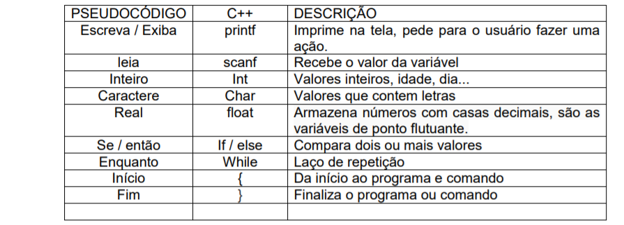

# PSEUDOCÓDIGO C++

### main() = Corresponde ao INÍCIO do algoritmo (main – principal em inglês), é por ela que se inicia a execução do programa.
### #include = Indica uso da biblioteca
### \n = significa “ir para a linha seguinte”, isto é, faz com que a próxima mensagem seja exibida na próxima linha da tela.
### # include <math.h> usa operações matemáticas -> Biblioteca
### main () função principal, identifica o programa.
### {} abre/fecha estruturas de comando (main (),if, else, for, while, switch).
### () abre/fecha comandos específicos para as estruturas.
### ; fecha uma linha de comando.
### int variáveis inteiras.
### float variáveis flutuantes (números com virgula).
### char = caracteres.
### printf (" ") escreve o que você quiser entre os " ".
### printf (" \n") \n serve para quebrar uma linha.
### printf (" %x ", y) imprime valor da variável y.
### scanf ("%x", &y) %x pode ser variáveis do int (%d), float (%f) ou char (%c) e y corresponde a variável escolhida pelo usuário.
### && e
### || ou
### == igual
### != diferente
### > maior
### < menor
### <= menor ou igual
### >= maior ou igual
### * multiplicação
### / divisão
### % resto da divisão (não é porcentagem)
### if () se
### while () enquanto
### system("pause") impede a janela do programa de fechar após executar o programa.
### No scanf usa-se %s,%d,%f..., para dizer ao programa qual do tipo da variável que irá armazenar.
### Já no printf ela serve para dizer onde o valor de sua variável irá aparecer.
### Ex: printf(“O numero %d é maior que o %d:”,var1,var2);
### "%s”, = para "string"
### "%d", = para números inteiros
### "%f", = para números não inteiros ... ponto flutuante
### "&" = aplicado no scanf antes da variável, serve para "apontar" o endereço de memória a ser ocupado pela variável específica. Todo o armazenamento de variáveis depende desse "apontamento" para um certo lugar com certo tamanho específico de memória que, como você deve saber, varia entre os diferentes tipos de variáveis. Quando é caractere não usa o e-comercial.

# ALGUMAS BIBLIOTECAS BÁSICAS

### stdio.h padrão de entrada e saída (leitura do teclado...)
### math.h funções matemáticas (achar a raiz quadrada, achar o seno, coseno, tangente, logaritmo na base 10)
### time.h declara funções para manipularmos a data e hora
### stdlib.h funciona como um emulador da prompt do sistema operacional que você está programando, caso seja Windows ele emula todos os comandos do DOS, se você estiver programando no Linux, quem será emulado é o Terminal.

## Fonte dos dados: paginas da Web.
